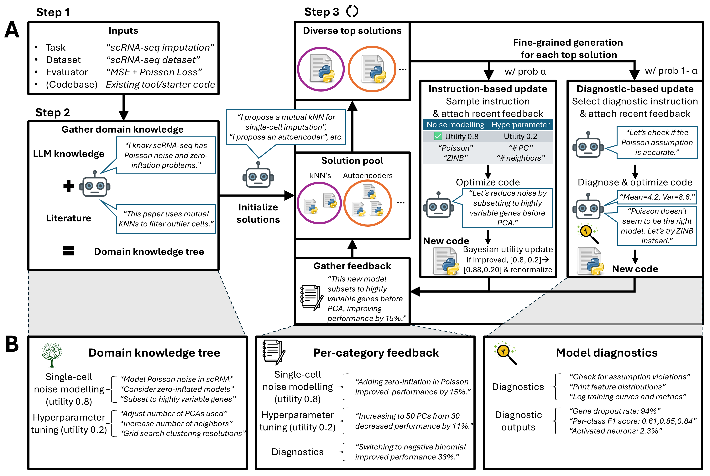

## What is TusoAI?

**TusoAI** is an open-source, agentic system for **scientific method optimization**. Given a task description and template (Python) script, TusoAI will autonomously implement and test optimizations to maximize a user-defined score. It mimics the process by which a researcher may optimize their own method: by considering their own knowledge of the task, extracting insights from the literature, diagnosing intermediate steps of their method/data, and considering feedback from previous attempts. This process can be initialized as _cold start_, without any existing method, or _warm start_, building off of an existing method. TusoAI outputs a final optimized method which scientists may use in downstream applications. See details below and in our paper.



### Who should use TusoAI?

TusoAI is intended for scientists in the process of building their method to perform well on some benchmark, e.g., simulations, train/test splits, real data benchmarks, etc. It can also be applied to general ML tasks.

---

## How to use TusoAI

### Installation

Download and unzip this directory. run_tusoai.ipynb is the main starting point of running TusoAI, see details in further sections below.

TusoAI requires only 4 base packages, listed in requirements.txt, which can be installed with the following.

```bash
pip install -r requirements.txt
```

TusoAI does not install further packages while running. However, it may propose using further packages while optimizing. It is usually beneficial to have an environment set up with many useful packages beforehand, so if TusoAI proposes an optimization that requires a package, it is able to implement this. This can vary by domain, e.g., a single-cell researcher will have many single-cell packages installed, or an ML practicioner will have many ML packages installed. A general purpose environment which has many useful ML packages installed beforehand is the aideml package (https://github.com/WecoAI/aideml/tree/main). This can be installed as below:

```bash
pip install -U aideml
```

### Setup

TusoAI requires a template file with a `tuso_model` function. This function is the only function TusoAI ever sees and operates on, the rest of the code remains fixed. This ensures the evaluation scheme is never altered, and enables TusoAI to work with arbitrarily large codebases. `tuso_model` can be empty and TusoAI will construct its own initial methods, or it can contain an existing method that TusoAI will build off of. This template file should print out an evaluation metric, which TusoAI will extract and use to evaluate performance. See `template.py` for an example, as well as initial files in the `examples` directory.


### Running

`run_tusoai.ipynb` is the starting point for using TusoAI. This file exposes all the hyperparameters, initializes the knowledge tree and solutons, and runs the optimization scheme. Notably, the user can add more categories, instructions, or initial solutions based off their own knowledge of the task. 

2 LLM backbones have been tested and are recommended: `gpt-4o-mini` from OpenAI, and `claude-3.5-haiku` from Anthropic. These models are cheap and fast, and perform as strongly, if not better than their more expensive counterparts `gpt-5` and `claude-4-sonnet`. For instance, running the denoising task for 8 hours cost ~$0.22 with `gpt-4o-mini`, and ~$22 with `gpt-5`, with roughly the same final performance.

### Extracting history


---

## Citation
